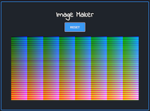

# Image Maker
A **single-page web application** that generates an image with customized size using 32,768 discrete colors.  [Try it out!](https://image-maker-react.herokuapp.com/)
## Overview
This app is built with **React** and deployed to **Heroku**. The quick guide is as follows:  
* **Width:** It allows users to customize the **width** of the image.
* **Height:** It allows users to customize the **height** of the image.
* **CREATE IMAGE:** Generate an image based on user input data.
* **RESET:** It allows users to **reset** the width and height.

  
  

## Error Handling
Valid inputs are required to generate an image.

  
  
  

## Directory Structure

    Image-Maker-React
    │
    ├── README.md
    │
    ├── src              
    │    ├── index.js
    │    ├── App.js
    │    ├── styles               # Sass files          
    │    └── components           # Component files
    │           
    └── public
         └── index.html